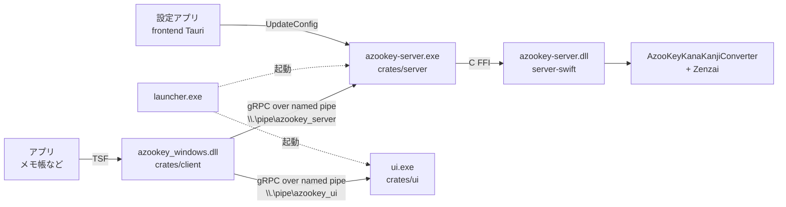

# ARCHITECTURE

azooKey-Windows（フォーク元: fkunn1326/azooKey-Windows, commit `65835aa`）の構造調査メモ。
フェーズ0時点のコードを読んだ結果で、行番号はこの時点のもの。

## 全体構成



- IME本体（DLL）はアプリのプロセス内で動く。変換エンジンは別プロセス（azookey-server.exe）。
- DLLはキー入力ごとに同期的（`block_on`）にgRPCを呼ぶ。

## crates/ の役割

| crate | 成果物 | 役割 |
| --- | --- | --- |
| `crates/client`（package名 `azookey-windows`） | `azookey_windows.dll`（cdylib、x64とx86） | TSFのテキストサービス本体。COMの登録、キーイベント処理、コンポジション操作、サーバーとのIPC |
| `crates/server`（`azookey-server`） | `azookey-server.exe` | gRPCサーバー（named pipe）。Swiftの`azookey-server.dll`をFFIで呼び、かな漢字変換を行う |
| `crates/shared` | lib | `.proto`から生成したgRPCコード（tonic）、設定ファイル`%APPDATA%\Azookey\settings.json`の読み書き（`AppConfig`） |
| `crates/ui` | `ui.exe` | 候補ウィンドウと入力モードインジケーター（tao + wry/WebView2）。gRPCサーバー（`azookey_ui` pipe） |
| `crates/launcher` | `launcher.exe` | Zenzaiバックエンド（cpu/cuda/vulkan）のDLLパスをPATHに足し、server と ui を起動 |
| `crates/macros` | proc-macro | `#[macros::anyhow]`：`anyhow::Result`を返す関数を`windows::core::Result`に変換（エラー時はログを出して`E_FAIL`） |
| `frontend/src-tauri` | 設定アプリ（Tauri + React） | 設定画面。保存時に`UpdateConfig` RPCでサーバーに再読込させる |
| `server-swift` | `azookey-server.dll` | AzooKeyKanaKanjiConverter（`7d5dd99`）を包むSwift。`@_silgen_name`でC関数を公開 |

## キー入力から確定までの流れ

TSFのエントリーポイントは `crates/client/src/tsf/factory.rs` の `TextServiceFactory`（`#[implement(ITfTextInputProcessor, ITfKeyEventSink, ITfCompositionSink, ...)]`）。

1. **`ITfKeyEventSink::OnTestKeyDown`**（`tsf/key_event_sink.rs`）
   - `process_key()` を呼び、`Some` なら「IMEがこのキーを消費する」として `TRUE` を返す。
2. **`ITfKeyEventSink::OnKeyDown`**（`tsf/key_event_sink.rs`）→ `handle_key()`（`engine/composition.rs:308`）
   - `process_key()` を再度呼び、得られた `Vec<ClientAction>` と遷移先状態を `handle_action()` に渡す。
3. **`process_key()`**（`engine/composition.rs:72`）＝ 状態遷移表
   - Ctrl押下中は無視。
   - `UserAction::try_from(wparam)`（`engine/user_action.rs`）で仮想キーを `Input(char) / Backspace / Enter / Space / Tab / Escape / Navigation / Function(F6-F10) / Number / ToggleInputMode` に変換。文字は `GetKeyboardState` + `ToUnicode` で求めるため、**Shift+W は `Input('W')` になる**。
   - `CompositionState`（`None / Composing / Previewing / Selecting`）と `InputMode`（`Latin / Kana`、`engine/input_mode.rs`）で分岐し、`ClientAction`（`engine/client_action.rs`）の列を返す。
   - 注意：`process_key()` はWindows APIとTextServiceの状態を直接読むため、現状テスト不能。
4. **`handle_action()`**（`engine/composition.rs:325`）＝ 副作用の実行
   - 最初に `update_context()`（`tsf/surrounded_text.rs:108`）でカーソル前の文字列を取得し `SetContext` RPCで送る。
   - `StartComposition` → `start_composition()`（`tsf/edit_session.rs:65`）、候補ウィンドウ表示
   - `AppendText(s)` → Kanaなら `to_fullwidth`（記号のみ全角化、英字はそのまま）→ `AppendText` RPC → 第`selection_index`候補を `set_text(text, subtext)` で表示（**ライブ変換**）
   - `RemoveText` → `RemoveText` RPC → 再表示
   - `SetSelection(Up/Down/Number)` → 候補を移動して表示
   - `ShrinkText(s)` → 先頭 `corresponding_count` 分を確定（`shift_start()`）し、残りに `s` を追加
   - `SetTextWithType` → F6〜F10 のひらがな/カタカナ/半角カナ/全角英/半角英
   - `EndComposition` → `end_composition()`（`tsf/edit_session.rs:105`）で表示中の文字列をそのまま確定、サーバー側を `ClearText`
   - 最後に `Composition`（`preview / suffix / raw_input / raw_hiragana / corresponding_count / selection_index / candidates / state`）を書き戻す。
5. **確定**：Enter（suffix空のとき）で `EndComposition`。suffixがあるときは `ShrinkText("")` で前半だけ確定して `Composing` を続ける。
6. その他のイベント
   - `ITfCompositionSink::OnCompositionTerminated`（`engine/composition.rs:55`）→ `EndComposition`
   - `ITfThreadMgrEventSink::OnSetFocus`（`tsf/thread_mgr_event_sink.rs`）→ `EndComposition`
   - `ITfTextLayoutSink`（`tsf/text_layout_sink.rs`）→ 候補ウィンドウ位置更新（`update_pos()`）

### 主要キーの処理箇所

| キー | 場所 | 現在の挙動 |
| --- | --- | --- |
| ライブ変換 | `handle_action` の `AppendText` / `RemoveText`（`composition.rs:372-426`） | 常時オン。打鍵ごとにサーバーが `requestCandidates` し、第1候補を表示。**オフにする設定は無い** |
| Shift | `user_action.rs` の `ToUnicode`（Shift状態込みで文字化）、数字キーのみ `VK_SHIFT` を見る | Shift専用の処理は無い。大文字はそのままサーバーへ送られ、azooKeyのroman2kanaで英字として残る → 「Wiんどws」になる |
| Backspace | `process_key` `composition.rs:132-141`（Composing）, `220-229`（Previewing） | `preview.chars().count() == 1` のときだけ `RemoveText + EndComposition`。**判定がサーバー側の読み（hiragana）ではなく変換後の表示文字列で行われている** |
| Enter | `process_key` `composition.rs:142-151`, `230-239` | suffix空なら `EndComposition`、あれば `ShrinkText("")`。コンポジションが空でも `Composing` 状態なら消費する |
| Space / Tab | `composition.rs:181-184`, `269-272` | `SetSelection(Down)`（次候補）。変換開始というより候補送り |
| Esc | `composition.rs:152-155` | `RemoveText + EndComposition`（1文字消して確定。ひらがなに戻す動作ではない） |

## Rust ⇔ server-swift の通信

### DLL ⇔ azookey-server.exe（gRPC, `crates/shared/service.proto`）

```proto
service AzookeyService {
  rpc AppendText (AppendTextRequest{text_to_append}) returns (AppendTextResponse{ComposingText});
  rpc RemoveText (RemoveTextRequest{})               returns (RemoveTextResponse{ComposingText});
  rpc ShrinkText (ShrinkTextRequest{offset})         returns (ShrinkTextResponse{ComposingText});
  rpc MoveCursor (MoveCursorRequest{offset})         returns (MoveCursorResponse{ComposingText});
  rpc ClearText  (ClearTextRequest{})                returns (ClearTextResponse{});
  rpc SetContext (SetContextRequest{context})        returns (SetContextResponse{});
  rpc UpdateConfig (UpdateConfigRequest{})           returns (UpdateConfigResponse{});
}
message ComposingText { string hiragana = 1; repeated Suggestion suggestions = 2; }
message Suggestion    { string text = 1; string subtext = 2; int32 corresponding_count = 3; }
```

- 未確定文字列の実体（`ComposingText`）は **Swift側のグローバル変数** に1つだけある。DLL側は候補のキャッシュを持つだけ。
- `text` = 候補の変換済み部分、`subtext` = その候補がカバーしない残りの読み、`corresponding_count` = 候補がカバーする入力数。

### DLL ⇔ ui.exe（gRPC, `crates/shared/window.proto`）

`ShowWindow / HideWindow / SetCandidate / SetSelection / SetWindowPosition / SetInputMode`

### azookey-server.exe ⇔ Swift（C FFI, `crates/server/src/main.rs` ⇔ `server-swift/Sources/azookey-server/azookey_server.swift`）

`Initialize, SetContext, AppendText, RemoveText, MoveCursor, ShrinkText, ClearText, GetComposedText, LoadConfig`

- 気付いた点：Swift側の `cursorPtr` / `lengthPtr` は `UnsafeMutablePointer<Int>`（64bit）だが、Rust側は `*mut c_int`（32bit）。8バイト書き込みで4バイト変数を越える。サーバープロセス内の問題でIME DLLのクラッシュとは別だが、将来直す候補。

## Zenzai の左文脈（leftSideContext）

**渡している（ただしZenzai有効時のみ効く）。**

1. `handle_action()` の冒頭で `update_context(&preview)`（`tsf/surrounded_text.rs:108`）がカーソル前のテキストを取得し `SetContext` RPC。
2. サーバー（`crates/server/src/main.rs` `set_context`）が `\r` で分割した最後の行だけをSwiftへ。
3. Swift `set_context` が `config["context"]` に保存し、`get_composed_text` → `getOptions(context:)` → `.v3(.init(profile:, leftSideContext: context))`。
4. `config["enable"]`（settings.jsonの`zenzai.enable`、既定 false）がfalseなら `zenzaiMode: .off` で左文脈は使われない。

フェーズ4の「左文脈を渡す」は、新規実装ではなく **動作確認と、改行・長さの扱いの見直し** になる見込み。

## panic 設定

- ワークスペース `Cargo.toml` に `[profile]` 設定は無い → `panic = "unwind"`（既定）。
- ただし COM の vtable 関数は windows-rs が生成する `extern "system"` 関数で、Rust 1.81以降は **unwind できない境界で panic すると abort する**。つまり DLL内のどこで panic してもホストアプリが落ちる。
- `#[macros::anyhow]`（`crates/macros/src/lib.rs`）は `Err` を `E_FAIL` にするだけで `catch_unwind` はしていない。
- DLL内の panic しうる箇所（フェーズ3-1の調査対象）
  - `composition.rs:381,382,385`（`AppendText`）: `candidates.texts[selection_index]` を直接インデックス
  - `composition.rs:468-478`（`SetSelection`）: 候補が空だと `min(len-1, ..) = -1` → `as usize` で巨大値 → 範囲外
  - `composition.rs:502,503,507`（`ShrinkText`）: `candidates.texts[0]` を直接インデックス。**Enter で `ShrinkText("")` が走り、サーバーが空の候補を返すとここで落ちる**
  - `lib.rs:47,61`（ロガー初期化、DLL_PROCESS_DETACH）の `unwrap()`
  - `engine/text_util.rs:140` の `unwrap()`

## 既知バグとの対応（仮説。フェーズ3で再現テストを書いて確定させる）

- **3-1 Enterで落ちる**：Backspaceの終了判定が「表示中の変換後文字列が1文字」になっているため、読みと表示の文字数がずれると、読みが空になってもコンポジションが `Composing` のまま残る。その状態のEnter / Spaceが、空の候補リストを直接インデックスする経路（上記）に入ると panic → abort と推定。
- **3-2 ライブ変換**：オン/オフのフラグが無く、`AppendText` のたびに変換候補を表示している。Swift側は常に `requestCandidates` する。オフ時は「ひらがな（`hiragana`）を表示」に切り替えれば、Swiftの変更なしで実現できる見込み。
- **3-3 Shift＋英字**：Shift専用の処理が無く、大文字がroman2kanaに流れて「Wiんどws」になる。

## ビルド

- `cargo make build --release`（`Makefile.toml`）: `cargo fmt` → `swift build` → `cargo build`（x64）→ `cargo build -p azookey-windows --target i686`（x86 DLL）→ Tauri → `post_build`（PowerShellで `build/` に集約）→ Inno Setup（`installer/Installer.iss`、出力 `build/azookey-setup.exe`）
- 既存CI: `.github/workflows/actions.yml`（push/PR/手動、windows-latest、Swift 6.0.2、llama.cpp prebuilt と zenz.gguf をダウンロード）。フォーク側ではまだ一度も実行されていない。

## Linux（Cloud Session）での確認方法

- `rustup target add x86_64-pc-windows-msvc` と `protoc`（`apt-get install protobuf-compiler`）があれば、
  `cargo check -p azookey-windows -p azookey-server -p ui -p launcher --target x86_64-pc-windows-msvc` が **cargo-xwin なしで通る**（リンクしないため）。
- `frontend/src-tauri` はチェック対象外（Tauriの依存が重い）。
